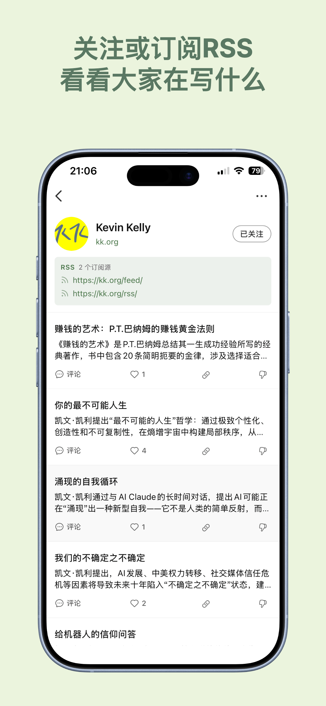
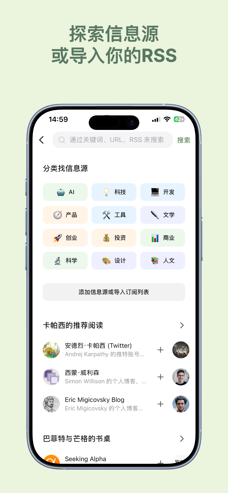
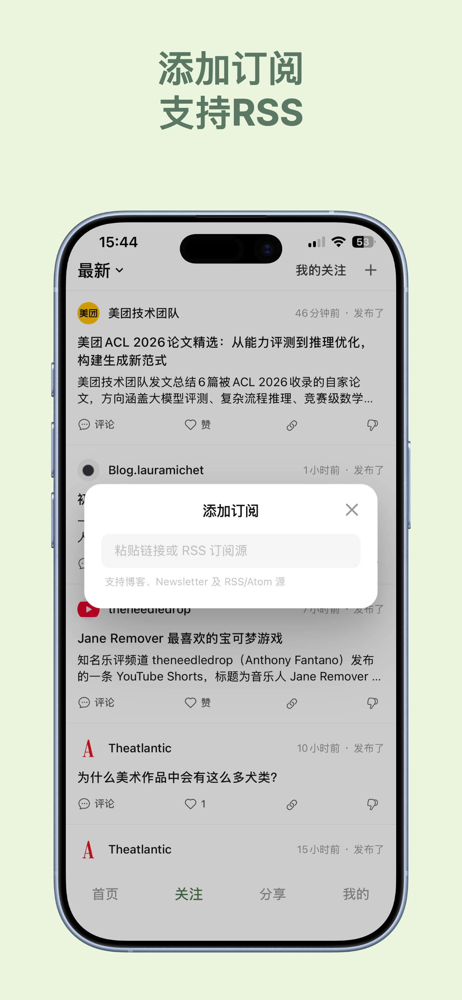
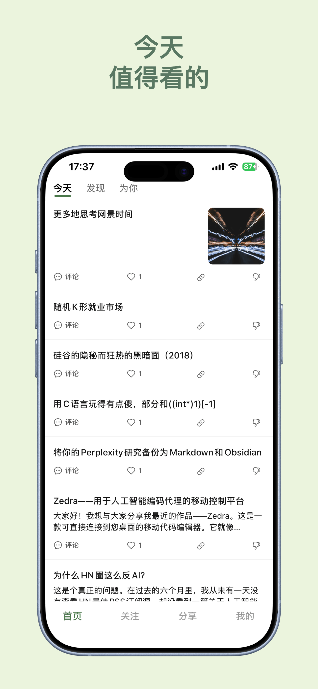
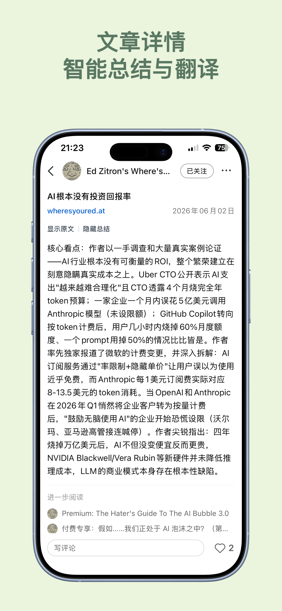
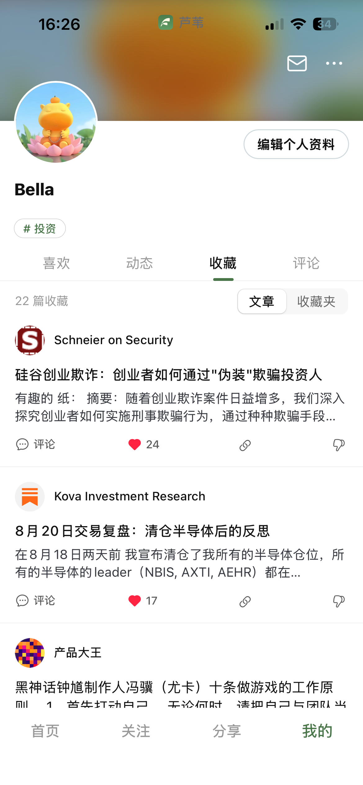

  

  <strong>芦苇 Reed</strong> · 发现值得看的内容，关注你感兴趣的更新

# 芦苇 Reed

> **让发现好内容，变得更容易。**
>
> 芦苇是一款面向高质量信息获取的 **RSS 阅读器与内容发现工具**：
> 聚合博客、论坛、播客、新闻与社交账号的更新，人工精选 + AI 摘要翻译，
> 帮你把值得读的内容找出来。

| 平台 | 入口 |
|------|------|
| iOS | <a href="https://apps.apple.com/cn/app/%E8%8A%A6%E8%8B%87-%E5%8F%91%E7%8E%B0%E5%A5%BD%E5%86%85%E5%AE%B9/id6756805406"> 前往 App Store下载</a> 或者搜索 芦苇 |
| Web 端 | [web.reeddaily.com](https://web.reeddaily.com/) |
| 手机网页版 | [reeddaily.com/reed](https://reeddaily.com/reed) |

**完全免费**：目前所有功能都免费，包括 AI 摘要与翻译，不限次数。

---

## 一、我们的特点

| 特点 | 说明 |
|------|------|
| **完全免费** | 所有功能都免费，AI 摘要、翻译不限次数 |
| **全品类订阅** | 博客、论坛、播客、新闻、社交账号、标准 RSS 都能订阅 |
| **人工运营精选** | 「今天」由人工策展，不是纯算法堆量 |
| **免费 AI** | 摘要、翻译、专属频道，帮助你快速消化内容 |
| **讨论区** | 围绕内容与同好交流，阅读不止于读完 |
| **OPML 导入导出** | 从别的阅读器带过来，也能带出去 |
| **多端同步** | 登录后 Web 与 iOS 阅读进度、收藏同步 |
| **中英文内容** | 精选覆盖中英文优质内容，外文内容一键翻译 |

---

## 二、文章合集

*以下为芦苇团队整理发布的精选文章。*

| 文章 | 一句话简介 | 发布时间 |
|------|-----------|---------|
| [有没有一款 AI 产品能拯救我的信息焦虑？](https://guide.reeddaily.com/posts/ai-yuan-sheng-xinxi-fenfa/) | 三类 AI 信息产品的局限，与芦苇「为你」的 AI 原生分发解法 | 2026-09-04 |
| [不用自己找信息源，AI 帮你生成专属阅读频道](https://guide.reeddaily.com/posts/ai-shengcheng-zhuanshu-pindao/) | 芦苇「为你」功能详解：说出兴趣，AI 持续帮你更新专属频道 | 2026-09-01 |
| [RSS 阅读器怎么选？Feedly、Reeder 之外这几款也值得一试](https://guide.reeddaily.com/posts/rss-yuedu-qi-tuijian-duibi/) | 从「管理已知信息源」和「发现未知内容」两个角度对比主流 RSS 阅读器 | 2026-09-01 |
| [13 个值得关注的 RSS 订阅源推荐](https://guide.reeddaily.com/posts/best-rss-feeds-for-tech-ai-startups-investing-design/) | 精选 AI、科技、创业、投资、设计与深度内容 RSS 订阅源 | 2026-08-28 |

---

## 三、适合谁使用

- **深度信息消费者**：订阅了大量博客、新闻、播客，需要一处聚合、按自己的节奏读完；
- **对算法推送感到厌倦的人**：不想要"猜你喜欢"式的信息流，希望订阅边界由自己划定；
- **跨语言阅读者**：需要读懂英文科技、投资、AI 内容的中文读者，AI 翻译帮你无门槛阅读；
- **持续学习者**：独立开发者、创投、研究员、设计师等需要稳定高质量信息来源的人；
- **想要掌控阅读节奏的人**：时间线或智能推荐，先读摘要再决定深入，收藏稍后读，从容安排阅读时间；
- **RSS 入门者**：对订阅感兴趣，但不知道怎么找订阅源、或觉得找订阅源很麻烦——芦苇的精选信息源目录帮你跳过这一步，直接订阅就行。

---

## 四、我们的功能

### 4.1 订阅：全品类信息源，聚合到一条时间线

支持博客、论坛、播客、新闻网站、社交账号以及标准 RSS 信息源，
把散落各处的更新收进同一条时间线，一次打开就能读完。

- 从精选信息源目录中直接选择，按分类查找；
- 粘贴订阅地址自定义导入；
- 支持 OPML/XML 订阅导入与导出，把关注轻松迁移到其他阅读器。

  
  
  

### 4.2 发现：遇见意料之外的好内容

- **「今天」**：人工运营的每日精选，打开就知道今天值得读什么；
- **「发现」**：基于兴趣探索好内容，遇见关注之外的信息。

  
  

### 4.3 阅读：AI 总结、讨论与分享

- **AI 总结**：自动提炼文章要点，先读总结，再决定是否深入阅读；
- 支持网页链接与图文展示，阅读体验干净；
- 内置网页浏览与一键翻译，外文内容也能顺畅阅读；
- 在评论区与同好讨论，让内容的价值在交流中放大；
- 把有意思、有价值、给人启发的东西分享给更多人。

  
  
  

### 4.4 关注与节奏：信息流由你掌控

- 关注用户和信息源，他们的更新会出现在你的信息流里；
- 时间线或智能推荐，两种阅读模式自由切换；
- 登录后，Web 端与 iOS 的阅读进度、收藏同步。

  
  

### 4.5 AI：专属频道、摘要与翻译

- **AI 专属频道**：用一句话描述想看的主题，AI 生成专属频道并持续更新；
- **AI 摘要**：自动提炼文章要点，先花十秒判断值不值得读；
- **AI 翻译**：外文内容一键翻译成中文，跨语言追踪你关心的领域。

**完全免费，不限次数。**

  
  

---

## 五、用户评价

*以下评价内容来自真实用户，为保护隐私，昵称均为化名。*

顶顶，在豆瓣小组里看到，觉得想法很好就下载了，页面简洁，内容很多。活在每天各种软件推送的垃圾信息里，还有这样一片净土，真的不容易。顺便说一句，姐妹太厉害了，能在工作之余做一个app出来，我在工作之余看完自己想看的东西都很难😂 —— @leafrain

最近每天都在用这个app，发现了很多有意思的内容💪 —— @sunnydays

这个app真的很有意义，信息来源很丰富，完全是高质量的Tech文章/创意合集，交互也很流畅。内置原网页和翻译功能特别方便。浏览各种各样的博文设计风格也是一种审美享受！就是有时候看完文章返回主页推荐内容已经自动刷新了，如果没点赞就很容易丢失刚刚看过的帖子，如果改成手动刷新是不是更好呢？总之非常喜欢这个app，希望楼主做大做强！ —— @deepdiver

挺好的，信息源丰富、内容质量高。 —— @roamingsoul

页面简洁，内容丰富，看内容很不错的 —— @quietpages

太棒了姐妹，我之前探索各种rss 阅读app ，很多不是操作麻烦就是界面不满意，你这个app做得真好，求姐妹分享开发这个app 的心路历程和经验 —— @peachfizz

天呐，前段时间就想能不能做一个订阅各个渠道的信息的app或者插件，也是用rss，主要是方便自己把经常看的信息集中到一起。然后实习没有时间去落地，刷到这个我要好好体验一下 —— @wayfarer

非常好的产品，希望 OP 坚持 —— @oldbookmark

从豆瓣小组推荐来的，试用了感觉还挺舒服，后面不知道会不会考虑分板块呢？ —— @rivercat

非常需要这些信息归纳软件，新闻软件下了一大堆。 --- @maomao

---

## 六、常见问题

**芦苇是什么？**
芦苇是一款结合 RSS 订阅、精选信源和 AI 推荐的信息发现工具，帮助你更高效地阅读高质量内容。

**芦苇支持哪些信息源？**
博客、论坛、播客、新闻网站、社交账号以及标准 RSS 信息源。

**芦苇和普通 RSS 阅读器有什么不同？**
除了 RSS 订阅，芦苇还提供内容发现、精选推荐、讨论区和 AI 专属频道，并且 AI 摘要、翻译完全免费。

**芦苇可以自动总结和翻译文章吗？**
可以。芦苇支持使用 AI 对内容进行摘要和翻译，完全免费、不限次数，帮助你快速判断文章是否值得深入阅读。

**芦苇收费吗？**
不收费。芦苇目前完全免费，所有功能都免费。

**芦苇需要登录账号吗？**
需要。登录后用于个性化推荐，并支持 Web 端与 iOS 多端同步。

**芦苇支持 OPML 导入/导出吗？**
支持。芦苇支持 OPML/XML 订阅导入，会解析列表中的用户与信息源，匹配到芦苇中的内容即可一键关注；同时支持将你的关注以 OPML 导出，迁移到其他阅读器。

**安卓版什么时候上线？**
安卓版正在筹备中。

---

## 七、联系我们

- 邮箱：support@reeddaily.com
- 公司：杭州文复网络科技有限公司
- 备案：浙ICP备2025150892号-2

© 2026 杭州文复网络科技有限公司

---

## 八、我们的理念

信息很多，但真正值得看的内容很难找。

我们喜欢在互联网上冲浪，发现那些有价值、有意思、给人启发的东西。但优质信息并不容易被看见——我们常常迷失在轻松刺激、情绪强烈、转瞬即逝的内容里，被平台推送牵着走，刷了一晚上却什么都没留下。

芦苇的选择是**把决定权交还给你**：

- **订阅由你决定**：谁进入你的信息流，由你选择，而不是算法替你决定；
- **内容由人策展**：「今天」精选由人工运营，把每天值得读的内容挑出来；
- **AI 帮你消化**：摘要、翻译完全免费，先判断值不值得读，再决定要不要深入。

我们精选了科技、金融、人工智能、设计、创业、编程、科学等多个领域的信息源，
供同样渴望深度阅读、喜欢分享的人在这里驻足、交流。
